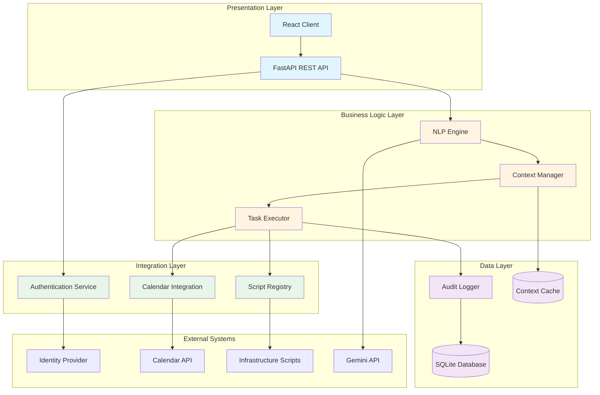
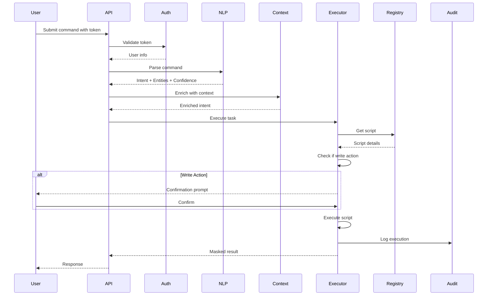

# Design Document - Nexus Intelligent Chatbot System

## Overview

The Nexus Intelligent Chatbot System is built using a **Layered Architecture** pattern, organizing components into distinct horizontal layers with clear separation of concerns. The system integrates existing implementations (authentication, basic chat, RAG service) with new components (NLP Engine, Context Manager, Task Executor, Script Registry, Audit Logger, Self-Correction Engine, Calendar Integration) to create a cohesive intelligent assistant platform.

The architecture consists of four primary layers:

1. **Presentation Layer**: React frontend client and REST API endpoints
2. **Business Logic Layer**: NLP Engine, Context Manager, Task Executor orchestration
3. **Integration Layer**: Script Registry, Calendar Integration, external service adapters
4. **Data/Persistence Layer**: Audit Logger, database operations, context storage

This design leverages the existing FastAPI-based authentication system, Gemini-powered chat API, and RAG service while adding the missing components specified in the requirements.

## Architecture

### System Architecture Diagram



### Component Interaction Flow



## Components and Interfaces

### 1. NLP Engine

**Purpose**: Parse natural language commands into structured intents and entities using the existing Gemini integration and RAG service.

**Technology**: Python, FastAPI, Google Gemini API, existing RAG service

**Key Classes**:
- `NLPEngine`: Main parsing orchestrator
- `ParsedIntent`: Data class containing intent, entities, confidence
- `Entity`: Data class for extracted parameters

**Interface**:
```python
class NLPEngine:
    def __init__(self, gemini_api_key: str, rag_service: RAGService, confidence_threshold: float = 0.5):
        """Initialize with Gemini API and RAG service"""
        
    async def parse_command(self, user_input: str, user_id: str) -> ParsedIntent:
        """
        Parse natural language command into intent and entities.
        
        Args:
            user_input: Raw user command
            user_id: User identifier for context
            
        Returns:
            ParsedIntent with intent, entities, and confidence score
        """
        
    def _extract_entities(self, text: str, intent: Intent) -> List[Entity]:
        """Extract entities based on intent type"""
        
    def _calculate_confidence(self, gemini_response: dict) -> float:
        """Calculate confidence score from Gemini response"""
```

**Intent Types**:
```python
class Intent(Enum):
    CHECK_STATUS = "check_status"
    RESTART_SERVICE = "restart_service"
    QUERY_METRICS = "query_metrics"
    SCHEDULE_MEETING = "schedule_meeting"
    SET_REMINDER = "set_reminder"
    REGISTER_SCRIPT = "register_script"
    UNKNOWN = "unknown"
```

**Entity Types**:
```python
class EntityType(Enum):
    SERVER = "server"
    SERVICE = "service"
    TIME = "time"
    METRIC = "metric"
    SCRIPT_NAME = "script_name"
    USER_EMAIL = "user_email"
```

### 2. Context Manager

**Purpose**: Maintain conversation context (last 3 messages) per user to resolve references.

**Technology**: Python, Redis or in-memory cache with TTL

**Key Classes**:
- `ContextManager`: Manages user conversation history
- `MessageHistory`: Stores messages for a user
- `Message`: Individual message with entities

**Interface**:
```python
class ContextManager:
    def __init__(self, max_context_size: int = 3):
        """Initialize with maximum context size"""
        
    def get_context(self, user_id: str) -> MessageHistory:
        """Retrieve user's conversation context"""
        
    def update_context(self, user_id: str, message: Message) -> None:
        """Add message to user's context and prune old messages"""
        
    def resolve_reference(self, user_id: str, reference: str, entity_type: EntityType) -> Optional[Entity]:
        """
        Resolve contextual references like 'it', 'that server', 'the service'.
        
        Args:
            user_id: User identifier
            reference: Reference text (e.g., "it")
            entity_type: Type of entity being referenced
            
        Returns:
            Resolved entity or None if not found
        """
        
    def clear_context(self, user_id: str) -> None:
        """Clear user's context (e.g., on logout)"""
```

**Data Structures**:
```python
@dataclass
class Message:
    text: str
    intent: Intent
    entities: List[Entity]
    timestamp: datetime
    
@dataclass
class MessageHistory:
    user_id: str
    messages: List[Message]  # Max 3 messages
    
    def add_message(self, message: Message) -> None:
        """Add message and maintain max size"""
```

### 3. Task Executor

**Purpose**: Orchestrate task execution, handle confirmations, mask sensitive data, and coordinate with Script Registry.

**Technology**: Python, FastAPI, subprocess for script execution

**Key Classes**:
- `TaskExecutor`: Main execution orchestrator
- `ExecutionResult`: Result data class
- `ConfirmationPrompt`: Confirmation request data class

**Interface**:
```python
class TaskExecutor:
    def __init__(self, script_registry: ScriptRegistry, audit_logger: AuditLogger, 
                 max_concurrent_tasks: int = 50):
        """Initialize with dependencies"""
        
    async def execute_task(self, task: Task, user: User) -> ExecutionResult:
        """
        Execute a task with appropriate handling.
        
        Args:
            task: Task containing intent, entities, and script info
            user: Authenticated user
            
        Returns:
            ExecutionResult with success status, output, and execution time
        """
        
    def requires_confirmation(self, task: Task) -> bool:
        """Check if task is a write action requiring confirmation"""
        
    async def execute_with_confirmation(self, task: Task, user: User) -> ConfirmationPrompt:
        """Generate confirmation prompt for write actions"""
        
    async def confirm_and_execute(self, prompt_id: str, confirmed: bool) -> ExecutionResult:
        """Execute task after confirmation"""
        
    def _mask_sensitive_data(self, output: str) -> str:
        """Mask passwords, API keys, tokens in output"""
        
    async def _invoke_script(self, script: Script, params: Dict[str, Any]) -> str:
        """Execute external script with parameters"""
```

**Data Structures**:
```python
@dataclass
class Task:
    intent: Intent
    entities: List[Entity]
    script_id: str
    parameters: Dict[str, Any]
    is_write_action: bool
    
@dataclass
class ExecutionResult:
    success: bool
    output: str  # Masked if sensitive
    error: Optional[str]
    execution_time_ms: int
    timestamp: datetime
    
@dataclass
class ConfirmationPrompt:
    prompt_id: str
    message: str
    task: Task
    user_id: str
    expiry_time: datetime
    confirmed: Optional[bool] = None
```

### 4. Script Registry

**Purpose**: Manage registration and metadata of executable scripts.

**Technology**: Python, SQLite database

**Key Classes**:
- `ScriptRegistry`: Registry manager
- `Script`: Script metadata and execution details

**Interface**:
```python
class ScriptRegistry:
    def __init__(self, db_connection: Connection):
        """Initialize with database connection"""
        
    def register_script(self, script: Script, admin_user: User) -> bool:
        """
        Register new script (admin only).
        
        Args:
            script: Script with metadata
            admin_user: Administrator registering the script
            
        Returns:
            True if successful, False if duplicate
        """
        
    def get_script(self, script_id: str) -> Optional[Script]:
        """Retrieve script by ID"""
        
    def find_scripts_by_intent(self, intent: Intent) -> List[Script]:
        """Find all scripts mapped to an intent"""
        
    def unregister_script(self, script_id: str, admin_user: User) -> bool:
        """Remove script (admin only)"""
        
    def list_all_scripts(self) -> List[Script]:
        """List all registered scripts"""
```

**Data Structures**:
```python
@dataclass
class Script:
    script_id: str
    name: str
    file_path: str
    language: ScriptLanguage  # PYTHON, BASH
    mapped_intents: List[Intent]
    parameters: List[Parameter]
    is_read_only: bool
    registered_by: str  # Admin email
    created_at: datetime
    
@dataclass
class Parameter:
    name: str
    type: str  # string, int, bool
    required: bool
    description: str
    
class ScriptLanguage(Enum):
    PYTHON = "python"
    BASH = "bash"
```

### 5. Audit Logger

**Purpose**: Maintain immutable audit trail of all executions.

**Technology**: Python, SQLite database with append-only operations

**Key Classes**:
- `AuditLogger`: Logging manager
- `AuditEntry`: Log entry data class

**Interface**:
```python
class AuditLogger:
    def __init__(self, db_connection: Connection):
        """Initialize with database connection"""
        
    async def log_execution(self, entry: AuditEntry) -> bool:
        """
        Log execution to database (immutable).
        
        Args:
            entry: Audit entry with execution details
            
        Returns:
            True if logged successfully
        """
        
    async def retrieve_logs(self, filter: LogFilter) -> List[AuditEntry]:
        """
        Retrieve logs with filtering.
        
        Args:
            filter: Filter criteria (user, date range, command type)
            
        Returns:
            List of matching audit entries
        """
        
    def _format_entry(self, entry: AuditEntry) -> str:
        """Format entry for database storage"""
```

**Data Structures**:
```python
@dataclass
class AuditEntry:
    entry_id: str  # UUID
    user_id: str
    user_email: str
    command: str
    intent: Intent
    result: ExecutionResult
    timestamp: datetime
    execution_time_ms: int
    
@dataclass
class LogFilter:
    user_id: Optional[str] = None
    start_date: Optional[datetime] = None
    end_date: Optional[datetime] = None
    intent: Optional[Intent] = None
    success_only: Optional[bool] = None
```

### 6. Self-Correction Engine

**Purpose**: Analyze execution errors and suggest fixes based on historical patterns.

**Technology**: Python, SQLite for error storage, pattern matching

**Key Classes**:
- `SelfCorrectionEngine`: Error analysis orchestrator
- `ErrorAnalysis`: Analysis result with suggestions
- `ErrorPattern`: Identified error pattern

**Interface**:
```python
class SelfCorrectionEngine:
    def __init__(self, db_connection: Connection):
        """Initialize with database connection"""
        
    async def analyze_error(self, error: ExecutionError) -> ErrorAnalysis:
        """
        Analyze error and suggest fixes.
        
        Args:
            error: Execution error details
            
        Returns:
            ErrorAnalysis with suggestions
        """
        
    async def store_error(self, error: ExecutionError) -> bool:
        """Store error in database for pattern learning"""
        
    def _identify_pattern(self, error: ExecutionError) -> Optional[ErrorPattern]:
        """Identify known error pattern"""
        
    def _generate_suggestions(self, pattern: ErrorPattern) -> List[str]:
        """Generate fix suggestions for pattern"""
```

**Data Structures**:
```python
@dataclass
class ExecutionError:
    error_id: str
    task: Task
    error_message: str
    stack_trace: Optional[str]
    timestamp: datetime
    
@dataclass
class ErrorPattern:
    pattern_id: str
    pattern_regex: str
    description: str
    common_causes: List[str]
    suggested_fixes: List[str]
    
@dataclass
class ErrorAnalysis:
    error_id: str
    pattern_matched: Optional[ErrorPattern]
    suggestions: List[str]
    confidence: float
```

### 7. Calendar Integration

**Purpose**: Interface with external calendar APIs for scheduling and reminders.

**Technology**: Python, Google Calendar API (or generic calendar interface)

**Key Classes**:
- `CalendarIntegration`: Calendar API adapter
- `MeetingRequest`: Meeting scheduling request
- `AvailabilityRequest`: Availability check request

**Interface**:
```python
class CalendarIntegration:
    def __init__(self, api_key: str, default_timezone: str = "UTC"):
        """Initialize with API credentials"""
        
    async def check_availability(self, request: AvailabilityRequest) -> AvailabilityResult:
        """
        Check calendar availability.
        
        Args:
            request: Availability check parameters
            
        Returns:
            AvailabilityResult with free time slots
        """
        
    async def book_meeting(self, request: MeetingRequest) -> MeetingResult:
        """
        Book meeting in calendar.
        
        Args:
            request: Meeting details
            
        Returns:
            MeetingResult with confirmation
        """
        
    async def set_reminder(self, reminder: Reminder) -> bool:
        """Create reminder in calendar"""
        
    def _parse_natural_language_time(self, time_expr: str) -> datetime:
        """Parse time expressions like 'tomorrow at 3pm'"""
```

**Data Structures**:
```python
@dataclass
class AvailabilityRequest:
    user_email: str
    start_time: datetime
    end_time: datetime
    duration_minutes: int
    
@dataclass
class AvailabilityResult:
    available_slots: List[TimeSlot]
    
@dataclass
class MeetingRequest:
    user_email: str
    title: str
    start_time: datetime
    duration_minutes: int
    attendees: List[str]
    
@dataclass
class MeetingResult:
    success: bool
    meeting_id: str
    confirmation_message: str
    
@dataclass
class Reminder:
    user_email: str
    title: str
    reminder_time: datetime
    description: Optional[str]
    
@dataclass
class TimeSlot:
    start: datetime
    end: datetime
```

### 8. Unified API Layer

**Purpose**: Provide REST API endpoints that orchestrate all components.

**Technology**: FastAPI, existing auth integration

**Key Endpoints**:
```python
# Command execution
POST /api/command
Request: {
    "command": str,
    "token": str
}
Response: {
    "intent": str,
    "confidence": float,
    "result": ExecutionResult | ConfirmationPrompt
}

# Confirmation
POST /api/confirm/{prompt_id}
Request: {
    "confirmed": bool,
    "token": str
}
Response: {
    "result": ExecutionResult
}

# Script registration (admin only)
POST /api/scripts
Request: {
    "script": Script,
    "token": str
}
Response: {
    "success": bool,
    "script_id": str
}

# Audit logs (admin only)
GET /api/audit
Query: {
    "user_id": Optional[str],
    "start_date": Optional[str],
    "end_date": Optional[str],
    "token": str
}
Response: {
    "logs": List[AuditEntry]
}

# Calendar operations
POST /api/calendar/schedule
Request: {
    "meeting_request": MeetingRequest,
    "token": str
}
Response: {
    "result": MeetingResult
}

POST /api/calendar/reminder
Request: {
    "reminder": Reminder,
    "token": str
}
Response: {
    "success": bool
}
```

## Data Models

### Database Schema

```sql
-- Users table (existing from auth module)
CREATE TABLE users (
    id INTEGER PRIMARY KEY AUTOINCREMENT,
    email TEXT UNIQUE NOT NULL,
    hashed_password TEXT NOT NULL,
    is_active BOOLEAN DEFAULT 1,
    role TEXT DEFAULT 'GENERAL',
    created_at TIMESTAMP DEFAULT CURRENT_TIMESTAMP,
    updated_at TIMESTAMP DEFAULT CURRENT_TIMESTAMP
);

-- Scripts table
CREATE TABLE scripts (
    script_id TEXT PRIMARY KEY,
    name TEXT NOT NULL,
    file_path TEXT NOT NULL,
    language TEXT NOT NULL,
    mapped_intents TEXT NOT NULL,  -- JSON array
    parameters TEXT NOT NULL,  -- JSON array
    is_read_only BOOLEAN NOT NULL,
    registered_by TEXT NOT NULL,
    created_at TIMESTAMP DEFAULT CURRENT_TIMESTAMP,
    FOREIGN KEY (registered_by) REFERENCES users(email)
);

-- Audit logs table
CREATE TABLE audit_logs (
    entry_id TEXT PRIMARY KEY,
    user_id TEXT NOT NULL,
    user_email TEXT NOT NULL,
    command TEXT NOT NULL,
    intent TEXT NOT NULL,
    success BOOLEAN NOT NULL,
    output TEXT,
    error TEXT,
    execution_time_ms INTEGER NOT NULL,
    timestamp TIMESTAMP DEFAULT CURRENT_TIMESTAMP,
    FOREIGN KEY (user_email) REFERENCES users(email)
);

-- Error logs table
CREATE TABLE error_logs (
    error_id TEXT PRIMARY KEY,
    task_json TEXT NOT NULL,
    error_message TEXT NOT NULL,
    stack_trace TEXT,
    timestamp TIMESTAMP DEFAULT CURRENT_TIMESTAMP
);

-- Error patterns table
CREATE TABLE error_patterns (
    pattern_id TEXT PRIMARY KEY,
    pattern_regex TEXT NOT NULL,
    description TEXT NOT NULL,
    common_causes TEXT NOT NULL,  -- JSON array
    suggested_fixes TEXT NOT NULL,  -- JSON array
    created_at TIMESTAMP DEFAULT CURRENT_TIMESTAMP
);

-- Confirmation prompts table (temporary storage)
CREATE TABLE confirmation_prompts (
    prompt_id TEXT PRIMARY KEY,
    message TEXT NOT NULL,
    task_json TEXT NOT NULL,
    user_id TEXT NOT NULL,
    expiry_time TIMESTAMP NOT NULL,
    confirmed BOOLEAN,
    created_at TIMESTAMP DEFAULT CURRENT_TIMESTAMP
);
```

### Context Storage

Context will be stored in-memory with TTL (Time To Live) using Python dictionaries or Redis:

```python
# In-memory structure
context_store: Dict[str, MessageHistory] = {}

# Redis structure (if using Redis)
# Key: "context:{user_id}"
# Value: JSON serialized MessageHistory
# TTL: 1 hour
```

## Correctness Properties

*A property is a characteristic or behavior that should hold true across all valid executions of a system—essentially, a formal statement about what the system should do. Properties serve as the bridge between human-readable specifications and machine-verifiable correctness guarantees.*


### Authentication and Authorization Properties

**Property 1: Valid credentials produce JWT tokens**
*For any* valid user credentials, authenticating with the Identity Provider should return a JWT token with the user's email encoded.
**Validates: Requirements 1.1**

**Property 2: Invalid credentials are rejected**
*For any* invalid credentials (wrong password, non-existent user), authentication should fail and return an error message without issuing a token.
**Validates: Requirements 1.2**

**Property 3: Token validation occurs before processing**
*For any* authenticated request, the system should validate the JWT token before executing the requested operation.
**Validates: Requirements 1.3**

**Property 4: Role-based access control**
*For any* GENERAL user attempting an admin-only action (script registration, audit log access), the system should deny access with an authorization error.
**Validates: Requirements 1.5**

### NLP and Intent Parsing Properties

**Property 5: Command parsing produces structured output**
*For any* natural language command, the NLP Engine should return a ParsedIntent containing an Intent enum value, a list of Entity objects, and a confidence score between 0 and 1.
**Validates: Requirements 2.1, 2.5**

**Property 6: Low confidence triggers fallback**
*For any* command where the NLP Engine produces a confidence score below 0.5, the system should return a fallback response requesting clarification instead of executing a task.
**Validates: Requirements 2.3**

**Property 7: Entity extraction by type**
*For any* command containing identifiable entities (server names, service names, time expressions, metric types), the NLP Engine should extract them with the correct EntityType classification.
**Validates: Requirements 2.4**

### Context Management Properties

**Property 8: Context size invariant**
*For any* user session, after adding N messages (where N > 3), the Context Manager should maintain exactly 3 messages (the most recent ones).
**Validates: Requirements 3.1, 3.3**

**Property 9: Reference resolution**
*For any* user session with stored entities, when a command contains a reference ("it", "that server"), the Context Manager should resolve it to the most recent entity of the matching type from the last 3 messages.
**Validates: Requirements 3.2**

**Property 10: User context isolation**
*For any* two different authenticated users, updating context for one user should not affect the context of the other user.
**Validates: Requirements 3.5, 11.5**

### Script Registry Properties

**Property 11: Script registration with metadata**
*For any* valid script submitted by an administrator, the Script Registry should store it with all required metadata fields (name, file_path, language, mapped_intents, parameters, is_read_only, registered_by) and return success.
**Validates: Requirements 4.1, 4.2**

**Property 12: Read-only flag preservation**
*For any* registered script, retrieving it from the registry should return the same is_read_only flag value that was set during registration.
**Validates: Requirements 4.3**

**Property 13: Script ID uniqueness**
*For any* script_id, attempting to register two different scripts with the same script_id should succeed for the first and fail for the second with a duplicate error.
**Validates: Requirements 4.4**

**Property 14: Intent mapping storage**
*For any* registered script with mapped intents, querying the registry by any of those intents should return the script in the results.
**Validates: Requirements 4.5**

### Task Execution and Confirmation Properties

**Property 15: Write actions require confirmation**
*For any* task where is_write_action is True, the Task Executor should generate a ConfirmationPrompt before execution and not execute until confirmation is received.
**Validates: Requirements 5.1**

**Property 16: Confirmed actions execute**
*For any* ConfirmationPrompt that is confirmed (confirmed=True), the Task Executor should execute the associated script and return an ExecutionResult.
**Validates: Requirements 5.2**

**Property 17: Canceled actions abort**
*For any* ConfirmationPrompt that is canceled (confirmed=False), the Task Executor should not execute the script and should return a cancellation message.
**Validates: Requirements 5.3**

**Property 18: Read actions execute immediately**
*For any* task where is_write_action is False, the Task Executor should execute the script immediately without generating a ConfirmationPrompt.
**Validates: Requirements 5.4, 10.4**

### Sensitive Data Masking Properties

**Property 19: Sensitive data is masked**
*For any* execution output containing sensitive patterns (passwords, API keys, tokens matching configured regex patterns), the masked output should replace those patterns with "***MASKED***".
**Validates: Requirements 6.1, 6.2**

**Property 20: Masking in multiple outputs**
*For any* task execution, if the output contains sensitive data, both the user-facing response and the audit log entry should contain the masked version.
**Validates: Requirements 6.3**

**Property 21: Clean output unchanged**
*For any* execution output that does not match any sensitive data patterns, the masking function should return the output unchanged.
**Validates: Requirements 6.5**

### Audit Logging Properties

**Property 22: Audit entry creation**
*For any* task execution, the Audit Logger should create an AuditEntry containing user_id, user_email, command, intent, result, timestamp, and execution_time_ms.
**Validates: Requirements 7.1, 7.5**

**Property 23: Immediate persistence**
*For any* created AuditEntry, it should be persisted to the database before the execution result is returned to the user.
**Validates: Requirements 7.2**

**Property 24: Audit log immutability**
*For any* persisted AuditEntry, attempting to update or delete it should fail (database constraints should prevent modification).
**Validates: Requirements 7.3**

**Property 25: Log filtering**
*For any* LogFilter with specified criteria (user_id, date_range, intent), the retrieve_logs function should return only AuditEntry records matching all specified criteria.
**Validates: Requirements 7.4**

### Calendar Integration Properties

**Property 26: Availability checking**
*For any* AvailabilityRequest, the Calendar Integration should make an API call to the Calendar API and return an AvailabilityResult with time slots.
**Validates: Requirements 8.1**

**Property 27: Meeting booking on availability**
*For any* MeetingRequest with an available time slot, the Calendar Integration should book the meeting and return a MeetingResult with success=True and a meeting_id.
**Validates: Requirements 8.2**

**Property 28: Reminder creation**
*For any* Reminder request, the Calendar Integration should create the reminder in the external calendar system and return success=True.
**Validates: Requirements 8.3**

**Property 29: Natural language time parsing**
*For any* time expression in natural language format ("tomorrow at 3pm", "next Monday at 10am"), the Calendar Integration should parse it to a valid datetime object.
**Validates: Requirements 8.4**

**Property 30: Calendar error handling**
*For any* calendar operation that fails (API error, network error), the system should return an error message describing the failure without crashing.
**Validates: Requirements 8.5**

### Self-Correction Engine Properties

**Property 31: Error analysis on failure**
*For any* task execution that fails (success=False), the Self-Correction Engine should analyze the error and return an ErrorAnalysis object.
**Validates: Requirements 9.1**

**Property 32: Pattern identification**
*For any* ExecutionError matching a known ErrorPattern regex, the Self-Correction Engine should identify the pattern and include it in the ErrorAnalysis.
**Validates: Requirements 9.2**

**Property 33: Suggestions for known patterns**
*For any* ErrorAnalysis where a pattern was matched, the suggestions list should contain at least one suggested fix from the pattern's suggested_fixes.
**Validates: Requirements 9.3**

**Property 34: Error storage**
*For any* ExecutionError, the Self-Correction Engine should persist it to the error_logs database table for future pattern analysis.
**Validates: Requirements 9.4**

**Property 35: Fallback for unknown errors**
*For any* ExecutionError that does not match any known pattern, the ErrorAnalysis should contain the raw error message and an empty suggestions list.
**Validates: Requirements 9.5**

### System Metrics Properties

**Property 36: Metric query execution**
*For any* metric query request (CPU, memory, disk, service status), the Task Executor should execute the appropriate read-only script from the Script Registry.
**Validates: Requirements 10.1**

**Property 37: Metric type support**
*For any* metric type in the set {CPU_USAGE, MEMORY_USAGE, DISK_SPACE, SERVICE_STATUS}, the system should have a registered script that can query that metric.
**Validates: Requirements 10.2**

**Property 38: Metric response formatting**
*For any* successful metric query, the response should be formatted as human-readable text (not raw JSON or binary data).
**Validates: Requirements 10.3**

**Property 39: Metric error handling**
*For any* metric query that fails, the system should return an ExecutionResult with success=False and a descriptive error message.
**Validates: Requirements 10.5**

### Concurrency and Queue Management Properties

**Property 40: Task queue capacity**
*For any* Task Executor, when 50 tasks are currently executing, attempting to submit a 51st task should result in a "busy" error message.
**Validates: Requirements 11.2, 11.3**

### Performance Monitoring Properties

**Property 41: Performance warning logging**
*For any* operation that exceeds its configured timeout threshold, the system should log a performance warning with the operation name and actual duration.
**Validates: Requirements 12.4**

**Property 42: External API timeouts**
*For any* external API call (Calendar API, Identity Provider), if the call does not complete within the configured timeout, the system should raise a timeout exception.
**Validates: Requirements 12.5**

### Integration and Error Handling Properties

**Property 43: Token propagation**
*For any* authenticated request, the JWT token should be passed to and validated by each component in the execution chain (NLP, Context, Task Executor).
**Validates: Requirements 13.2**

**Property 44: Graceful component failure**
*For any* component that raises an exception during request processing, the system should catch the exception, log it, and return an error response without crashing the entire service.
**Validates: Requirements 13.3**

**Property 45: External service unavailability**
*For any* external service (Identity Provider, Calendar API, Script execution) that is unavailable, the system should return a descriptive error message without crashing.
**Validates: Requirements 14.1**

**Property 46: Retry with exponential backoff**
*For any* transient failure (network timeout, temporary service unavailability), the system should retry the operation with exponentially increasing delays (e.g., 1s, 2s, 4s).
**Validates: Requirements 14.2**

**Property 47: Database error handling**
*For any* database operation that fails, the system should log the error with stack trace and return a user-friendly error message (not exposing database internals).
**Validates: Requirements 14.3**

**Property 48: Input validation**
*For any* user input (command, script registration, configuration), the system should validate it against expected formats/types before processing.
**Validates: Requirements 14.4**

**Property 49: Unhandled exception logging**
*For any* unhandled exception, the system should log the full stack trace and return a generic "Internal server error" message to the user.
**Validates: Requirements 14.5**

### Configuration Management Properties

**Property 50: Configuration loading**
*For any* required configuration parameter (JWT_SECRET, DATABASE_URL, etc.), the system should successfully load it from environment variables or configuration files at startup.
**Validates: Requirements 15.1**

**Property 51: Configuration parameter support**
*For any* configuration parameter in the set {JWT_SECRET, TOKEN_EXPIRY, DATABASE_URL, CALENDAR_API_KEY, CONFIDENCE_THRESHOLD}, the system should read and use the configured value.
**Validates: Requirements 15.2**

**Property 52: Invalid configuration rejection**
*For any* invalid configuration (missing required parameter, invalid format), the system should fail to start and log a descriptive error message.
**Validates: Requirements 15.3**

**Property 53: Configuration defaults**
*For any* optional configuration parameter that is not provided, the system should use a documented default value.
**Validates: Requirements 15.5**

## Error Handling

### Error Response Format

All API endpoints will return errors in a consistent format:

```json
{
    "error": {
        "code": "ERROR_CODE",
        "message": "Human-readable error message",
        "details": {
            "field": "Additional context"
        }
    }
}
```

### Error Codes

- `AUTH_FAILED`: Authentication failure
- `UNAUTHORIZED`: Insufficient permissions
- `INVALID_INPUT`: Input validation failure
- `LOW_CONFIDENCE`: NLP confidence below threshold
- `SCRIPT_NOT_FOUND`: Script not in registry
- `CONFIRMATION_REQUIRED`: Write action needs confirmation
- `CONFIRMATION_EXPIRED`: Confirmation prompt timed out
- `QUEUE_FULL`: Task queue at capacity
- `EXECUTION_FAILED`: Script execution error
- `EXTERNAL_SERVICE_ERROR`: External API failure
- `DATABASE_ERROR`: Database operation failure
- `INTERNAL_ERROR`: Unhandled exception

### Retry Strategy

For transient failures:
1. First retry: 1 second delay
2. Second retry: 2 seconds delay
3. Third retry: 4 seconds delay
4. After 3 retries: Return error to user

### Timeout Configuration

- NLP parsing: 5 seconds
- Script execution: 30 seconds
- Calendar API calls: 10 seconds
- Identity Provider: 5 seconds
- Database operations: 3 seconds

## Testing Strategy

### Dual Testing Approach

The Nexus system will employ both **unit testing** and **property-based testing** to ensure comprehensive coverage:

**Unit Tests**:
- Specific examples demonstrating correct behavior
- Edge cases (empty inputs, boundary values, null handling)
- Error conditions (invalid credentials, missing data, API failures)
- Integration points between components
- Mock external services (Calendar API, Identity Provider, Gemini API)

**Property-Based Tests**:
- Universal properties that hold for all inputs
- Comprehensive input coverage through randomization
- Minimum 100 iterations per property test
- Each property test references its design document property

### Property-Based Testing Framework

**Language**: Python
**Framework**: Hypothesis (https://hypothesis.readthedocs.io/)

**Configuration**:
```python
from hypothesis import given, settings
import hypothesis.strategies as st

@settings(max_examples=100)
@given(credentials=st.builds(Credentials, 
                              email=st.emails(), 
                              password=st.text(min_size=8)))
def test_property_1_valid_credentials_produce_tokens(credentials):
    """
    Feature: nexus-complete-system, Property 1: Valid credentials produce JWT tokens
    
    For any valid user credentials, authenticating with the Identity Provider 
    should return a JWT token with the user's email encoded.
    """
    # Test implementation
```

### Test Organization

```
tests/
├── unit/
│   ├── test_auth_service.py
│   ├── test_nlp_engine.py
│   ├── test_context_manager.py
│   ├── test_task_executor.py
│   ├── test_script_registry.py
│   ├── test_audit_logger.py
│   ├── test_self_correction.py
│   └── test_calendar_integration.py
├── property/
│   ├── test_auth_properties.py
│   ├── test_nlp_properties.py
│   ├── test_context_properties.py
│   ├── test_execution_properties.py
│   ├── test_audit_properties.py
│   └── test_integration_properties.py
├── integration/
│   ├── test_end_to_end_flow.py
│   ├── test_api_endpoints.py
│   └── test_database_operations.py
└── conftest.py  # Shared fixtures
```

### Test Coverage Goals

- Unit test coverage: >80% of code lines
- Property test coverage: 100% of correctness properties
- Integration test coverage: All major user flows
- Edge case coverage: All error handling paths

### Mocking Strategy

**External Services to Mock**:
- Gemini API (use fixed responses for testing)
- Calendar API (mock availability and booking)
- Identity Provider (mock authentication)
- File system (for script execution)

**Database Testing**:
- Use in-memory SQLite for fast tests
- Separate test database for integration tests
- Reset database state between tests

### Continuous Integration

Tests will run on every commit:
1. Linting and type checking (mypy, pylint)
2. Unit tests (fast, <1 minute)
3. Property tests (medium, <5 minutes)
4. Integration tests (slower, <10 minutes)

### Performance Testing

Separate performance test suite:
- Load testing with 50 concurrent users
- Response time validation (<2s for reads)
- Memory leak detection
- Database query optimization

## Implementation Notes

### Technology Stack

- **Backend**: Python 3.10+, FastAPI
- **Database**: SQLite (development), PostgreSQL (production)
- **Authentication**: JWT with python-jose
- **NLP**: Google Gemini API, existing RAG service
- **Testing**: pytest, Hypothesis
- **API Documentation**: OpenAPI/Swagger (auto-generated by FastAPI)
- **Frontend**: React (existing client/)

### Deployment Architecture

```
┌─────────────────┐
│  React Client   │
└────────┬────────┘
         │ HTTPS
┌────────▼────────┐
│   FastAPI App   │
│  (Unified API)  │
└────────┬────────┘
         │
    ┌────┴────┬────────┬──────────┐
    │         │        │          │
┌───▼───┐ ┌──▼──┐ ┌───▼────┐ ┌──▼────┐
│ Auth  │ │ NLP │ │ Task   │ │ Audit │
│Service│ │Engine│ │Executor│ │Logger │
└───┬───┘ └──┬──┘ └───┬────┘ └──┬────┘
    │        │        │         │
    └────────┴────────┴─────────┘
                 │
            ┌────▼────┐
            │ SQLite  │
            │Database │
            └─────────┘
```

### Security Considerations

1. **JWT Secret**: Must be strong (min 32 characters), stored in environment variable
2. **Password Hashing**: bcrypt with salt (already implemented in auth/)
3. **SQL Injection**: Use parameterized queries (SQLite library handles this)
4. **Input Validation**: Pydantic models for all API inputs
5. **Rate Limiting**: Implement rate limiting on API endpoints (future enhancement)
6. **HTTPS**: Enforce HTTPS in production
7. **CORS**: Configure allowed origins (already in chat/chat_api.py)

### Migration from Existing Code

The implementation will integrate with existing modules:

1. **auth/**: Keep as-is, extend with role-based checks
2. **chat/chat_api.py**: Integrate into unified API, use for NLP
3. **model/rag_service.py**: Use for entity extraction and context
4. **client/**: Update to call new unified API endpoints

### Database Migrations

Use Alembic for schema migrations:
```bash
alembic init alembic
alembic revision --autogenerate -m "Initial schema"
alembic upgrade head
```

### Configuration Management

Use python-dotenv for environment variables:
```
# .env file
JWT_SECRET=your-secret-key-min-32-chars
DATABASE_URL=sqlite:///./nexus.db
GEMINI_API_KEY=your-gemini-key
CALENDAR_API_KEY=your-calendar-key
CONFIDENCE_THRESHOLD=0.5
MAX_CONCURRENT_TASKS=50
TOKEN_EXPIRY_MINUTES=30
```

### Logging Configuration

Use Python's logging module with structured logging:
```python
import logging
import json

logging.basicConfig(
    level=logging.INFO,
    format='%(asctime)s - %(name)s - %(levelname)s - %(message)s',
    handlers=[
        logging.FileHandler('nexus.log'),
        logging.StreamHandler()
    ]
)
```

### API Versioning

Use URL path versioning:
- `/api/v1/command`
- `/api/v1/scripts`
- `/api/v1/audit`

This allows future API changes without breaking existing clients.
